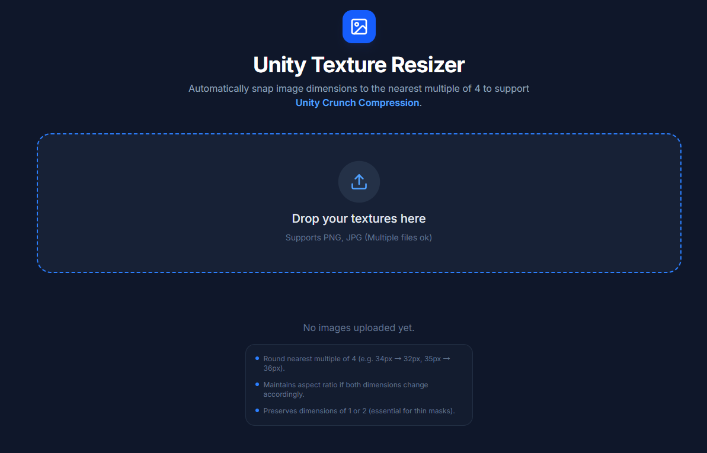
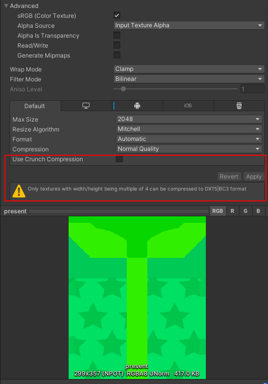

# Unity Texture Resizer

A professional, high-performance web utility designed for Unity developers to optimize textures. This tool automatically snaps image dimensions to the nearest multiple of 4, a critical requirement for enabling **Unity's Crunch Compression** (which requires DXT1/DXT5 formats that only work with 4-aligned dimensions).

If you do not resize texture as following, you will not get **Unity's Crunch Compression** work. And the texture will not be compressed as your wish. If you care about the game package size, such as [H5 games online](https://www.arcadeh5.com/), you must use the smaller texture as you can and compress those textures for all of them as need.

Compress texture is the **MUST** step while considering reduce package size.

## ✨ Features

- Smart Rounding Logic: Automatically adjusts dimensions to the nearest multiple of 4.
- Preserve 1px/2px: Intelligently ignores 1px and 2px dimensions to preserve thin masks or single-pixel utility textures.
- Bulk Processing: Upload dozens of textures and process them all in one click.
- Client-Side Processing: All image manipulation happens in your browser—your files are never uploaded to a server (privacy-first).
- Bulk Download: Export all processed images as a single structured .zip file.
- Original Filenames: Keeps your original filenames intact for easy replacement in your Unity project.
- AI Optimization Tips: Displays real-time Unity optimization advice powered by Google Gemini.

## 📐 Rounding Logic

The tool follows these specific rules to ensure the best balance between quality and compression compatibility:

- 1px -> 1px (Preserved)
- 2px -> 2px (Preserved)
- 33px -> 32px (Round down to nearest multiple of 4)
- 34px -> 32px (Round down to nearest multiple of 4)
- 35px -> 36px (Round up to nearest multiple of 4)

## 🚀 Local Setup

To run this project on your local machine, follow these steps:

### Prerequisites
- Node.js (v18+ recommended)
- A Google AI Studio API Key (from aistudio.google.com)

### Installation

1. Initialize Project (using Vite):
   npm create vite@latest unity-texture-resizer -- --template react-ts
   cd unity-texture-resizer

2. Install Dependencies:
   npm install lucide-react jszip @google/genai

3. Environment Configuration:
   Create a .env file in the root directory:
   VITE_API_KEY=your_gemini_api_key_here

4. Copy Source Files:
   Replace the contents of src/ with the provided App.tsx, types.ts, index.tsx, and utils/imageUtils.ts.

5. Run Development Server:
   npm run dev

## 🛠️ Tech Stack

- Frontend: React + TypeScript
- Styling: Tailwind CSS
- Icons: Lucide React
- Compression: JSZip (for bulk export)
- AI: Google Gemini API (for optimization insights)
- Processing: HTML5 Canvas API (High-quality resampling)

## 📄 License

This project is specialized for the Unity game development community. Use it freely to speed up your asset pipelines!